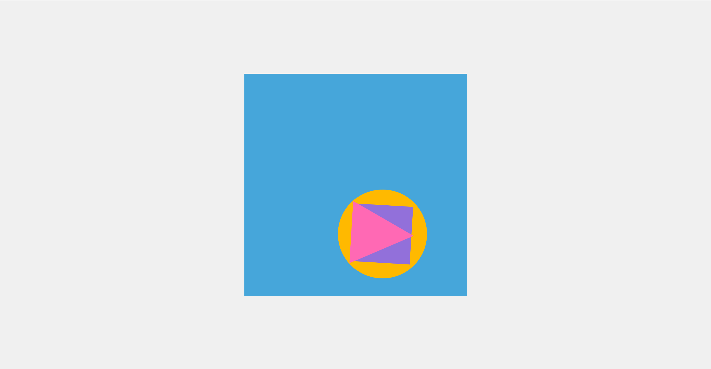

<h1>CSS Shapes Animation Challenge</h1>

<section>
    <h2>Challenge Description</h2>
    
This challenge focuses on creating complex animated shapes using CSS animations. It involves combining different shapes such as circles, squares, and triangles, each with its own unique animation, to create visually appealing effects.

</section>

<section>
    <h2>Table of Contents</h2>
    <ul>
        <li><a href="#challenge-description">Challenge Description</a></li>
        <li><a href="#purpose">Purpose</a></li>
        <li><a href="#features">Features</a></li>
        <li><a href="#prerequisites">Prerequisites</a></li>
        <li><a href="#challenge-structure">Challenge Structure</a></li>
        <li><a href="#installation">Installation</a></li>
        <li><a href="#preview">Preview</a></li>
        <li><a href="#contributing">Contributing</a></li>
        <li><a href="#author">Author</a></li>
    </ul>
</section>

<section>
    <h2>Purpose</h2>
    
The purpose of this challenge is to enhance skills in CSS animations and transformations by creating complex shapes and applying dynamic animations to them.

</section>

<section>
    <h2>Features</h2>
    <ul>
        <li>Animations for circle, square, and triangle shapes.</li>
        <li>Keyframes for bounce, rotate, and pulse effects.</li>
        <li>Responsive layout using flexbox.</li>
        <li>Color variations for visual impact.</li>
    </ul>
</section>

<section>
    <h2>Prerequisites</h2>
    
To participate in this challenge, basic knowledge of HTML and CSS is required. Familiarity with CSS animations and keyframes will be helpful.

</section>

<section>
    <h2>Challenge Structure</h2>
    
Participants are required to:

    <ol>
        <li>Implement HTML structure for nested shapes.</li>
        <li>Apply CSS styles for shapes and animations.</li>
        <li>Fine-tune animations using keyframes.</li>
        <li>Test responsiveness and adjust layout if necessary.</li>
    </ol>
</section>

<section>
    <h2>Installation</h2>
    
To run this project locally:

    <ol>
        <li>Clone the repository:</li>
    </ol>
    <code>git clone https://github.com/Yashi-Singh-1/Day-16-CSS-Shapes-Animation.git</code>
    <ol start="2">
        <li>Open <code>index.html</code> in a web browser.</li>
    </ol>
</section>

<section>
    <h2>Preview</h2>
    
View the live demo: <a href="https://codepen.io/Yashi-the-lessful/pen/WNBLGLr">CSS Shapes Animation Demo</a>

    
Screenshot 

    

</section>

<section>
    <h2>Contributing</h2>
    
Contributions to improve the animations or add new features are welcome. Fork the repository and submit a pull request with your changes.

</section>

<section>
    <h2>Author</h2>
    <ul>
        <li>Yashi Singh</li>
    </ul>
</section>

</article>

